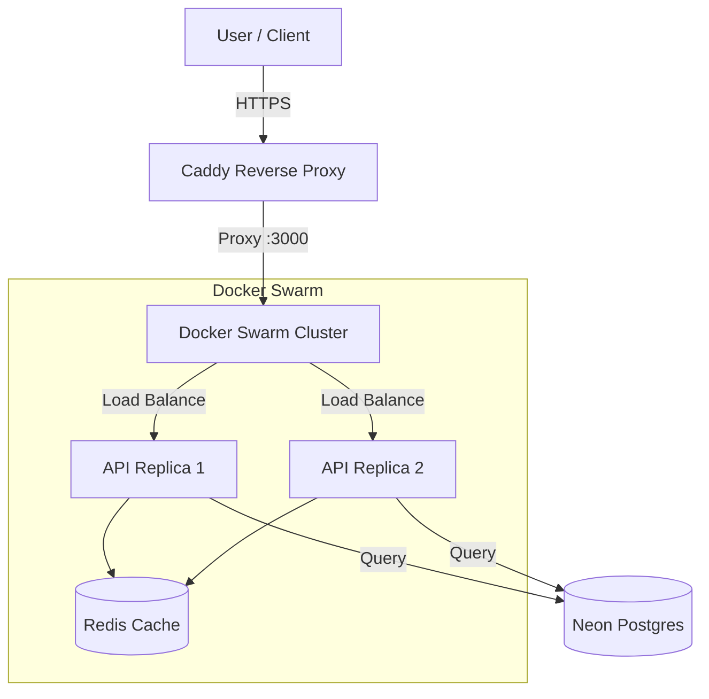

# 🚀 Deployment & Infrastructure Guide

This document explains our production deployment strategy using **GitHub Actions**, **Docker Swarm**, **Caddy**, and **Neon DB**.

---

## 1. High-Level Architecture

We use **Docker Swarm** on AWS EC2 for orchestration, **Caddy** as a reverse proxy, and **Neon** for serverless Postgres (ephemeral & production database).



---

## 2. CI/CD Pipeline

Our pipeline is automated using GitHub Actions.

### 🔄 CI: Continuous Integration (`ci.yaml`)

- **Trigger:** Pull Requests to `main`.
- **Tasks:**
  - Linting (ESLint)
  - Build verification
- **Goal:** Ensure code quality before merging.

### 🧪 Ephemeral Preview Environments (`ephemeral.yaml`)

- **Trigger:** Pull Request Open/Update.
- **Action:**
  1. Creates a **unique Neon DB branch** for the PR.
  2. Runs Prisma migrations on this isolated DB.
  3. Sets `DATABASE_URL` to this preview DB for testing.
- **Cleanup:** Automatically deletes the DB branch when the PR is closed.

### 🗄️ Database Migrations (`db-migrations.yaml`)

- **Trigger:** Push to `main`.
- **Flow:**
  1. `migrate-dev-db`: Applies migrations to the Development DB.
  2. `migrate-production`: Applies migrations to the **Production DB** (only if dev succeeds).

### 🚀 CD: Continuous Deployment (`cd.yaml`)

- **Trigger:** **Manual** (`workflow_dispatch`).
- **Flow:**
  1. **Build:** Builds Docker image & pushes to Docker Hub.
  2. **Update:** Updates `compose.yaml` with the new image tag.
  3. **Commit:** Commits the tag change back to the repo (skip CI).
  4. **Deploy:** SSH into EC2 Manager Node and runs:
     ```bash
     docker stack deploy -c compose.yaml taskManager
     ```
  5. **Verify:** Waits for executing replicas to match desired count.

---

## 3. Server Request Flow

graph TD
%% NODES
User((User))
Caddy[Caddy Reverse Proxy]
SwarmLB[Swarm Internal Load Balancer]

    subgraph Swarm [Docker Swarm Cluster]
        direction TB
        SwarmLB --> API[API Service (Replicas)]
        API <--> Redis[(Redis Cache)]
    end

    %% EXTERNAL SERVICES
    Neon[(Neon - Postgres)]
    Cloud[(Cloudinary)]

    %% FLOW
    User -->|HTTPS| Caddy
    Caddy -->|Proxy :3000| SwarmLB

    API -->|Read/Write| Neon
    API -->|Uploads| Cloud

    %% STYLING
    classDef plain fill:#fff,stroke:#333,stroke-width:1px;
    classDef db fill:#e1f5fe,stroke:#0277bd,stroke-width:2px;
    classDef ext fill:#fff3e0,stroke:#ff9800,stroke-width:2px;

    class User,Caddy,SwarmLB,API plain
    class Redis,Neon,Cloud db

---

## 4. Infrastructure Components

| Component              | Role                                                                                    | Config File                  |
| ---------------------- | --------------------------------------------------------------------------------------- | ---------------------------- |
| **Caddy**              | Reverse Proxy, SSL termination (future), Static file serving. Forwards requests to API. | `Caddyfile`                  |
| **Task Manager (API)** | Node.js Express Backend. Runs as a scalable Swarm service.                              | `Dockerfile`, `compose.yaml` |
| **Redis**              | Caching layer for API responses and session store.                                      | `compose.yaml`               |
| **Neon DB**            | Serverless Postgres Database. Separated execution/storage.                              | `External`                   |

### Service Configuration (`compose.yaml`)

- **Replicas:** 2 API instances (high availability).
- **Update Config:** Rolling updates (start-first) to ensure zero downtime.
- **Networks:** All services share `task_net` overlay network.
- **Secrets:** Sensitive keys (DB URL, SMTP) are mounted as Docker secrets.

---

## 5. Deployment Commands

Commands usually run by CI/CD, but useful for manual management on EC2.

```bash
# Deploy/Update Stack
docker stack deploy -c compose.yaml taskManager

# Check Service Status
docker service ls
docker service ps taskManager_taskmanager

# View Logs
docker service logs -f taskManager_taskmanager

# Scale API Manually
docker service scale taskManager_taskmanager=4
```
