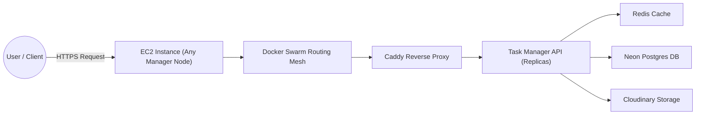

# Deployment & Infrastructure Architecture

This document details the production deployment architecture for the Task Manager Application. The system is deployed on AWS EC2 using **Docker Swarm** for orchestration, **Caddy** for reverse proxying, and **GitHub Actions** for CI/CD.

## 1. Infrastructure Overview

Our production environment consists of a **3-node Docker Swarm Cluster** hosted on AWS EC2 instances, ensuring high availability and fault tolerance.

- **Orchestration**: Docker Swarm (Swarm Mode)
- **Nodes**: 3 AWS EC2 Instances
- **Role**: All 3 nodes are **Swarm Managers**.
  - **1 Leader Node**: Handles orchestration decisions and state reconciliation.
  - **2 Reachable Nodes**: Participate in the Raft consensus and can become leader if the leader fails.
- **Networking**: Docker Overlay Network (`task_net`) for secure internal communication.
- **Ingress**: Swarm Routing Mesh (PublishPort) + Caddy Reverse Proxy.

---

## 2. Request Lifecycle & Flow



When a user interacts with the application, the request follows this path:

1.  **User → EC2**: The client sends an HTTPS request to the EC2 domain. The request can hit **any** of the 3 Manager Nodes.
2.  **Swarm Routing Mesh**: Swarm's ingress load balancer receives the traffic on port 80/443 and forwards it to the Caddy service.
3.  **Caddy Reverse Proxy**: Caddy handles TLS termination and routes the request to the internal `taskmanager` service via the `task_net` overlay network.
4.  **API Service**: Swarm load-balances the request to one of the available `taskmanager` replicas.
5.  **Dependencies**: The API interacts with **Redis** (cache), **Neon Postgres** (DB), or **Cloudinary** (storage) as needed.
6.  **Response**: The response returns via the same path: `API → Caddy → User`.

## 3. High-Availability Strategy

### Manager Nodes Configuration

We utilize **3 Manager Nodes** to ensure the Swarm cluster remains operational even if one EC2 instance fails.

- **Raft Consensus**: The 3 managers maintain a consistent view of the cluster state.
- **Fault Tolerance**: The cluster can survive the loss of **1 manager node** without losing quorum.

### Service Scaling & Resilience

- **Replicas**: The application service is defined with `replicas: 2` (in `compose.yaml`) but can be scaled up instantly (e.g., to 10) depending on traffic.
- **Rolling Updates**: Deployments use `order: start-first`, ensuring new containers are healthy before killing old ones, resulting in **zero-downtime deployments**.
- **Health Checks**:
  - **Redis**: Checks via `redis-cli ping`.
  - **API**: Checks via `wget` to the `/docker-health` endpoint.
  - If a container becomes unhealthy, Swarm automatically kills and replaces it.

---

## 4. Secure Configuration (Secrets)

We **never** hardcode sensitive credentials in the codebase or environment files.

- **Production Secrets**: Managed via **Docker Swarm Secrets**.
- **Creation**: Secrets are created manually on the Manager Leader node one time.
  ```bash
  echo "my-secret-value" | docker secret create database_url -
  ```
- **Usage**: Services mount these secrets at runtime (e.g., `/run/secrets/database_url`).
- **CI/CD**: GitHub Actions uses **GitHub Secrets** to authenticate with Docker Hub and SSH into the Swarm Manager to trigger updates.

## 5. Deployment Pipeline

1.  **Code Change**: Developer merges code to `main`.
2.  **CI Build**: GitHub Workflow builds the Docker image and pushes it to **Docker Hub**.
3.  **CD Trigger**: The workflow SSHs into the **Leader Node**.
4.  **Swarm Update**:
    ```bash
    docker stack deploy -c compose.yaml taskManager
    ```
5.  **Rollout**: Swarm pulls the new image and performs a rolling update across the cluster.
