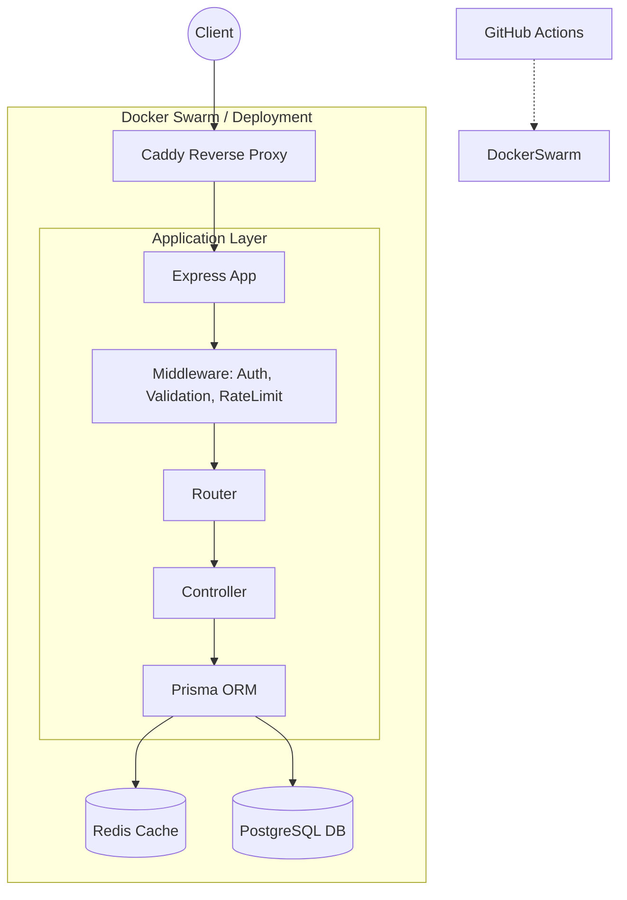

# Project Management Backend (Node.js, Express, Prisma, Docker, PostgreSQL)

A production-ready, scalable backend system for managing projects, teams, tasks, and users. Built with security and performance as top priorities.

**Note:** This is a restricted system. **Normal users CANNOT register themselves.** Only authenticated users with sufficient privileges can create new accounts.

To tackle this restriction during development, the project includes a **`seed.ts`** file that automatically initializes the database with a full permission hierarchy and sample data.

---

## 🛠 Tech Stack

- **Core**: Node.js + Express 5, TypeScript
- **Database**: PostgreSQL + Prisma ORM
- **Cache & Rate Limit**: Redis
- **Validation**: Zod
- **Auth**: JWT (Access + Refresh with rotation)
- **Logging**: Winston
- **Infrastructure**: Docker, Docker Swarm, Caddy (Reverse Proxy)
- **CI/CD**: GitHub Actions
- **Storage**: Cloudinary

---

## 🚀 Key Features

- **🛡 Full RBAC**: Granular permissions (SuperAdmin, Admin, Manager, User).
- **🔒 Secure Auth**: Login, Restricted Register, Email Verify, Password Reset, Token Rotation.
- **📁 Project Management**: Strict access control for projects and team members.
- **✅ Task System**: Hierarchical tasks (subtasks), deadlines, status tracking.
- **⚡ Performance**: Redis caching strategies and API rate limiting.
- **☁️ Media**: Secure file uploads via Cloudinary.
- **🏗 Architecture**: Controller-based pattern using Prisma for data access.
- **🌱 Data Seeding**: Rich initial dataset via `prisma/seed.ts`.

---

## 🧱 Architecture Diagram



---

## 🛡 Role & Access Summary

The system follows a strict hierarchy for user management and project access:

### 1. System Roles (User Creation)

- **SuperAdmin**: Has absolute control. Can create **Admins** and **Managers**.
- **Admin**: Can create **Managers** and **Users**. Can promote/demote Managers.
- **Manager**: Can only create **Users**.
- **User**: Read/Write access to assigned resources only. Cannot create users.

### 2. Project Roles (Contextual Access)

- **PROJECT_HEAD**: Typically **SuperAdmins** or **Admins**. They own the project and have full control.
- **PROJECT_MANAGER**: Typically **Managers**. They oversee the project, assign tasks, and manage members.
- **TEAM_MEMBER**: Typically **Users**. They can view projects and work on assigned tasks.

**Reminder:** Public registration is disabled. Users must be invited or created by an administrator.

---

## ⚡ API Overview

### 🔐 Auth

```http
POST /api/v1/users/login
{
  "email": "admin@example.com",
  "password": "password123" // min 6 chars
}

POST /api/v1/users/refresh-access-token
{ "refreshToken": "..." }
```

### 👥 System Management (RBAC)

```http
// SuperAdmin Only
POST /api/v1/system/admin
{ "email": "admin@example.com", "password": "...", "fullName": "Admin User", "userPassword": "current_password" }

// SuperAdmin or Admin
POST /api/v1/system/manager
{ "email": "manager@example.com", "password": "...", "fullName": "Manager User", "userPassword": "current_password" }

// Admin, SuperAdmin, or Manager
POST /api/v1/users/register
{ "email": "user@example.com", "role": "USER", "fullName": "Normal User", "password": "..." }
```

### 📁 Projects

```http
POST /api/v1/projects
{
  "displayName": "New Project", // min 6 chars
  "description": "Project details..."
}

POST /api/v1/projects/:id/members
{ "email": "user@example.com", "projectRole": "PROJECT_MANAGER" }
```

### ✅ Tasks

```http
POST /api/v1/tasks
{
  "title": "Fix Critical Bug", // min 3 chars
  "projectId": "uuid-...",
  "assignedToId": "uuid-...",
  "priority": "HIGH"
}

GET /api/v1/tasks/project/:projectId
```

---

## 🌱 Seeding Data

This project requires initial roles and users to function.
Running `npm run seed` (or letting the Docker entrypoint handle it) creates:

1.  **SuperAdmin** (`superadmin@example.com`)
2.  **Admin** (`admin@example.com`)
3.  **Manager** (`manager@example.com`)
4.  **User** (`user@example.com`)

It automatically assigns these users to a sample project to demonstrate role hierarchy:

- **Admin** → Project Head
- **Manager** → Project Manager
- **User** → Team Member

👉 **Default password for all accounts is `password`.**
(See [SETUP.md](./SETUP.md) for more details).

---

## 📂 Project Structure

```
src/
├── config/        # Environment & Constants
├── controllers/   # Request Handlers
├── middlewares/   # Auth, Zod Validation, Error Logic
├── routes/        # API Endpoints
├── utils/         # Helpers (Logger, AppError)
├── validators/    # Zod Schemas
├── app.ts         # App Setup
└── index.ts       # Entry Point
```

---

## 📜 Scripts

| Script          | Description                         |
| :-------------- | :---------------------------------- |
| `npm run dev`   | Start development server (nodemon)  |
| `npm run build` | Build TypeScript to JavaScript      |
| `npm run start` | Run production build                |
| `npm run seed`  | Populate database with initial data |
| `npm run lint`  | Run ESLint check                    |

---

## 🔗 External Links

Detailed documentation has been separated to keep this file clean:

- 🛠 **For Installation & Setup:** See **[SETUP.md](./SETUP.md)**
- 🚀 **For Deployment (Docker/CI/CD):** See **[DEPLOYMENT.md](./DEPLOYMENT.md)**

---

## 📄 License & Contribution

Contributions are welcome!
Licensed under **ISC**.
